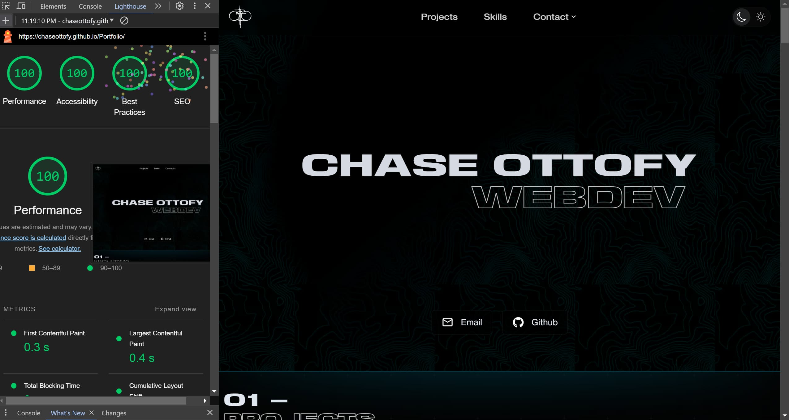

# [ottofy.dev](https://ottofy.dev)

> **Warning**
> Regarding the form: Refer to the [Form](#contact-form) section for information on how to setup the contact form, your build.
> Regarding the image optimization script: Requires setup, refer to the [Images](#images) section before running any CLI commands.

---

Special thank you to [@webdiscus](https://github.com/webdiscus) founder of [html-bundler-webpack-plugin](https://github.com/webdiscus/html-bundler-webpack-plugin) for help configuring the plugin.



---

**Table of Contents**

<!-- - [Notes](#notes) -->
- [Cloning](#cloning)
- [Features](#features)
- [Form](#contact-form)
  - [Apps Script Setup](#apps-script-setup)
- [Images](#images)
  - [How I handle Project Images](#how-i-handle-project-images)
  - [CLI Commands](#cli-commands)
- [Resources](#resources)

## Cloning

Clone the repository and install dependencies

```bash
git clone
cd portfolio
npm install
```

Create a .env file in the root of the project, it can be empty or if you want to use the contact form, follow the steps in [Apps Script Setup](#apps-script-setup) and add the `SHEET_ID` to the .env file.

```bash
touch .env
```

---

**If you decide to not use the contact form**, follow the steps below to remove it from the project:

1.  Remove the following files: `/src/components/form` & `/src/styles/sections/contactForm.css`

2.  Remove the following lines from `/src/index.js`

```javascript
import initForm from './components/form/form';
initForm();
```

3.  Remove the following Tag from `/src/index.html`

```html
<article class="contact-form--container"></article>
```

---

## Features

- Zero 3rd party code/dependencies, all assets are local.
- 100% Vanilla JS & Vanilla CSS
  - Includes linting for both JS and CSS
- Handlebars
  - If you are unfamiliar with handlebars, don't worry, I've only implemented the most basic feature and it's all self explanatory. It's just an easy way to create reusable html templates, and more importantly, break up long html files. All configuration is done in the webpack config within the html-bundler-webpack-plugin. Just define the entry `index.hbs` and the directory where the templates `partials` are located. The plugin is a dev dependency and does not affect the build.
  - Prioritizes DOM updates vs re-renders, very aggressive memory management. 
  - Majority of content is defined in JSON, and then loaded into templates. Zero additional nodes are created on load to avoid layout shifts.
- UX focused design, 100% from scratch
  - Useful custom vanilla hooks: closeOnEsc, throttle, copyToClipboard, etc.
  - Custom vanilla components: tabs, modals, toast, tooltips, image preview, etc.
  - Two themes (light and dark): Both verified to be AAA contrast compliant.
  - Responsive on all devices: Mobile first design
- Utilizes a very simple form integration with google sheets using Apps Script.
  - Free to use, no external requests, no server needed.
- Images/SVGS
  - All images/svgs are properly sized to their display size.
  - All icons are svgs.
  - Lazy loaded when in or near the viewport.
  - Custom CLI script to compress, scale to specific size or aspect ratio, and create both large and small outputs in bulk.
    - see [Images](#images)
- Performance:
  - Perfect score on all major audits (Lighthouse, page speed insights, gtmetrix)
  - Passes all accessibility audits (WAVE, Lighthouse, nu html checker)
  - Accessible: perfect score on several audits (WAVE, Lighthouse, page speed insights, NU HTML checker)
- Custom components
  - Tab system that works as a gallery.
  - Easy to integrate Tooltip system.
  - Image preview.
  - Configurable Toasts.
  - Skeletons/Loaders.
- Hooks
  - Close on escape
  - Copy to clipboard
  - Handle state
  - Throttle
- Webpack
  - js, css, & html minification
  - js split
  - hash naming
  - babel
  
---

## Contact Form

The Form is integrated with google sheets using Apps Script - the process is very simple and free to use.

> Apps Script Setup (Google Sheets)

1.  Create a new google sheet
2.  Locate `Apps Script` in the `Extensions` menu and open it
3.  Add a new file and name it `Code.gs` (or whatever you want)
4.  Copy the full url of your google sheet e.g. `https://docs.google.com/spreadsheets/d/.../edit#gid=0`
5.  Paste the following code into the file:

```javascript
// replace the URL with your own google sheet URL
const sheets = SpreadsheetApp.openByUrl("https://docs.google.com/spreadsheets/d/.../edit#gid=0");
const sheet = sheets.getSheetByName("Sheet1");

function doPost(e) {
    let data = e.parameter;

    // appendRow will recieve the formData : {messageName, contactMethod, messageContactVal, messageVal} in my case
    sheet.appendRow([data.messageName, data.contactMethod, data.messageContactVal, data.messageVal]);
    return ContentService.createTextOutput("Success");
}
```

6.  Click Deploy -> New Deployment
7.  Select `Web App` as the type
8.  Set 'Who has access' to 'Anyone'
9.  Click Deploy
10. Copy the Deployment ID
11. Create a .env and set `SHEET_ID` to the Deployment ID
12. Setup the fetch, or use the one provided in the project.

```javascript
fetch(`https://script.google.com/macros/s/${process.env.SHEET_ID}/exec`, {
    method: 'POST',
    body: new FormData(form),
})
```

---

## Images

> Project Images

- I have turned overwrites off by default just in case someone accidentally sets the output directory to the wrong folder.
- I wrote this to fit my very specific needs but after finding myself using it over and over again, I decided to include it in the project.
- I included a bunch of CLI commands but I recommend just setting the directories manually and to test everything in a test project before running it on your actual project.

In short, I use the script to do the following:
First, I keep all project images within the same directory on the same level.

- Large image names end in '1' and small images end in '2'. (you can customize this in the script)
- The script compresses each image, and formats all images to the same width and height. It then uses a predefined multiplier to create a small version of the images ending in '2'. There are also options to ensure that an aspect ratio is maintained for small and images, in my case, I use 4/3 for small images and 16/9 for large images.
- It utilizes the sharp library for all image processing, and in my opinion, there is no better library or tool for compression and easy manipulation (I wish they had a contrast filter though).
- Everything else is sketchy, I don't really ever mess around with node, so hopefully this works for you. I wouldn't include it if I ever had problems with it but I'm not sure if different operating systems will cause issues (I'm on windows).

### CLI Commands

| Command               | Description                                                                                  | Example                                       |
| --------------------- | -------------------------------------------------------------------------------------------- | --------------------------------------------- |
| `setparse`            | Run the actual optimization (make sure to set up first either manually or with CLI commands) | `npm run setparse`                            |
| `setparse:help`       | Get a list of all commands                                                                   | `npm run setparse:help`                       |
| `setparse:base`       | Set the base directory                                                                       | `npm run setparse:base base/directory`        |
| `setparse:sub`        | Set the sub directory                                                                        | `npm run setparse:sub folderWithinBase`       |
| `setparse:out`        | Set the output directory                                                                     | `npm run setparse:out outputFolderWithinBase` |
| `setparse:wh`         | Set the width and height of the large image                                                  | `npm run setparse:wh 1600 900`                |
| `setparse:multiplier` | Set the multiplier for the large image                                                       | `npm run setparse:multiplier 0.1`             |
| `setparse:format`     | Set the format of the large image                                                            | `npm run setparse:format jpg`                 |
| `setparse:ar`         | Set the aspect ratio of the small image                                                      | `npm run setparse:ar 4/3`                     |
| `setparse:current`    | Get the current config                                                                       | `npm run setparse:current`                    |
| `setparse:quality`    | Set the quality of the large image                                                           | `npm run setparse:quality 1-99`               |

> **Warning**
> It is recommended to manually optimize images before running the script.
> The script will not work if any of the directories are not set properly.
> The image optimization script is not perfect, it is very personalized to my needs, I use it to set all images to the same aspect ratio and size, and to create a small and large version of each image in different aspect ratios within the same folder.

---

## Resources
- [placeholder images](https://dummyimage.com/1600x900/000/000&text=.)
- [textures](https://www.transparenttextures.com/)
- [textures-two](https://www.toptal.com/designers/subtlepatterns/)
- [vercel-icons](https://vercel.com/design/icons)
- [react-icons](https://react-icons.github.io/react-icons/search)
- [Neue-Montreal-Font](https://pangrampangram.com/products/neue-montreal)
- [Basement-Expanded-Font](https://grotesque.basement.studio/)
