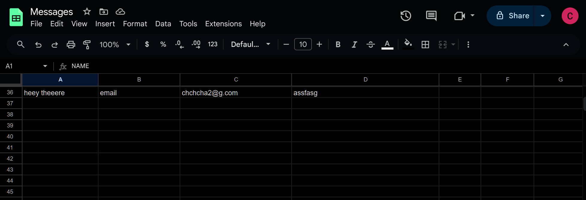

# [ottofy.dev](https://ottofy.dev)




personal portfolio

wanted to make this as snappy as possible, still think webpack/vanilla is the best...


**If you plan on forking this and using it as a template**

you'll have to --

- update the json data in src/data/json
- udpate the images in src/assets/images/imgproj && src/assets/images/mugshot
- configure the form to send the data somewhere,

here's an example of something you could implement through Apps Script in sheets: for this the other step is get the macro exec path which will serve as the fetch url

```javascript
const sheets = SpreadsheetApp.openByUrl("https://docs.google.com/spreadsheets/d/<YOUR SHEET ID HERE>");
const sheet = sheets.getSheetByName("Sheet1");

function doPost(e){
  let data = e.parameter;
  const { parameter: {
    messageName,
    contactMethod,
    messageContactVal,
    messageVal,
  }} = e;
  sheet.appendRow([
    messageName,
    contactMethod,
    messageContactVal,
    messageVal,
  ]);
  return ContentService.createTextOutput("Success");
}
```


