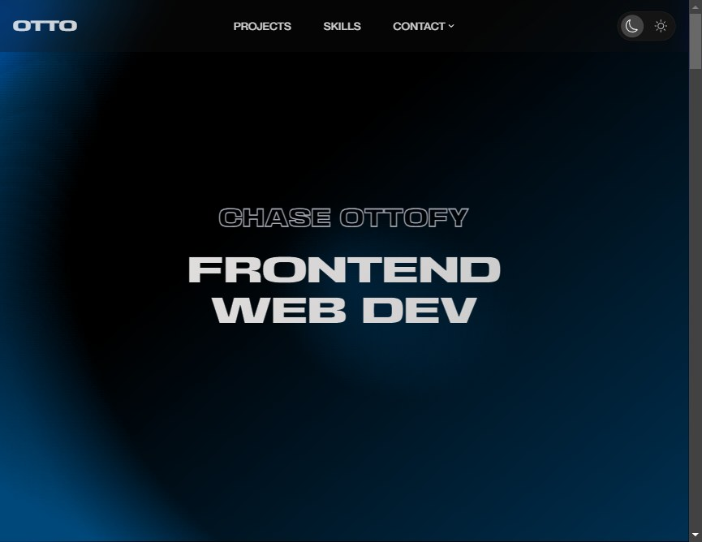

# Portfolio

> **Warning**
> The image optimization script CLI commands are a work in progress
___

Special thank you to [@webdiscus](https://github.com/webdiscus) for taking the time to optimize my webpack configuration. If you use webpack, be sure to check out [html-bundler-webpack-plugin](https://github.com/webdiscus/html-bundler-webpack-plugin)!

___


## Images

#### Project Images

Project images are handled differently than all other images
- The original images are stored in the src/images/imgprojstart folder
- Each project contains a large and small image within this folder.
- The calendar project is the only project with multiple images, it contains 10 images total, 2 for each 'view' of the project.
- It is preferred that project images are 

> **Warning**
> To utilize the image optimization script included in this project, a list of CLI commands is provided below.
- For instances where multiple arguments are used, example being `npm run setparse:wh 1600 900`, separate the arguments by a space.

#### Set the Base Directory where the images are located
```bash
# npm run setparse:base full/path/to/baseimgdir
# example:
npm run setparse:base src/images
```
> **Warning**
> Your project images should be located in a subfolder of this directory.
> - If you do not provide a path, the default path will be used. `[src/images]`.
> By default, the images are located in the src/images/imgprojstart folder.
> To change the subdirectory name, run the command below.

#### Set the Subdirectory where the images are located within the Base Directory
> By default, the subdirectory is named `imgprojstart`
```bash
npm run setparse:sub imgprojstart
```

#### Set the Subdirectory where the optimized images will be located within the Base Directory
> By default, the subdirectory is named `imgproj`
```bash
npm run setparse:opt imgproj
```

#### Set the desired output width and height for the images
> By default, the width is set to `1600` and the height is set to `900`
```bash
# npm run setparse:wh width height
example: npm run setparse:wh 1600 900
```

#### Set the desired output format for the images
> By default, the format is set to `webp`
> Must be one of the following: `webp`, `jpeg`, `png`, `avif`
```bash
# npm run setparse:format format
example: npm run setparse:format webp
```

#### Set the desired output quality for the images
> By default, the quality is set to `99`
> Must be a number between `1` and `100`
```bash
npm run setparse:quality 99
```

Using a custom node script that utilizes the sharp library, the images are resized to fit one specific aspect ratio, optimized, converted to webp if not already, and then moved to the src/images/imgproj folder. This is done BEFORE the webpack build process and is NOT dynamic. You must run this script manually - it only has to be run once.
- The script is located in the scripts folder at the root of the project in the file named `parse.mjs`
- To call the script, first ensure that it is properly configured.

All project images are imported via the src/utilities/get-image.js file. They are then distributed throughout the project from there.

